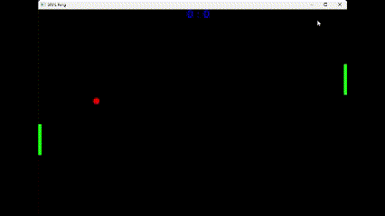

# Pong 
A simple, 2D, two player game, where the players objective is to prevent a ball from touching the the wall. 

# Languages and Tools used
- Language :- C++
- Graphics Library :- SFML 2
- IDE :- Visual Studio

# Preview

